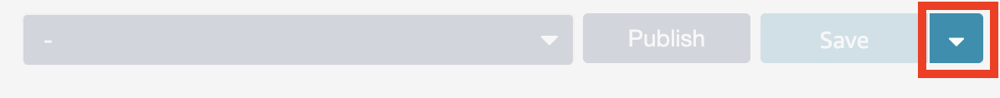

# AWS Connect Demo

## Getting Started

 - `nvm use && npm install`
 - `npm run stage` <-- Chained npm script command that will build and create a deployment zip for lambdas and synthesize the CF template.
 - `npm run deploy:app`

## Configuring the Connect Instance 

- Once the stack is deployed, manually provision a Connect Instance.
- Then, follow the steps in the link below to link the lambdas to your Connect instance.
https://docs.aws.amazon.com/connect/latest/adminguide/connect-lambda-functions.html#function-contact-flow
- Import the `Vanity` Contact flow located at the root of this project.
  - If you're starting from the Connect Dashboard, first navigate to the `Contact flows` page
  - On the right side of the screen, you'll see a button `Create contact flow`. Clicking the button will bring you to an empty Contact Flow Designer.
  - Click the highlighted button on the right of the page
  - 
  - Click import and upload the file named `Vanity` from this repo
- Configure a number to respond to the Contact Flow.

## Testing / Demo

- `npm run test` for unit tests

## Architecture Diagram

### Pitfalls / Lessons Learned
- Very new to provisioning resources/stacks with Cloudformation, first time working with the CDK.
- No CDK Support for Connect? Configuration was done manually.
- I'm sure there was a better way to package and deploy the lambdas. In a production environment, it would be hooked up to CI with tests.
- Went down a rabbit hole filled with red herrings related to IAM. Took me a **while** to find the documentation to add the lambdas to the Connect instance manually.
- Data Access pattern is not as graceful as I would like. Better granularity for permissions and operations. Create some type defs to act as a schema.
- Write everything down. Even the stuff that doesn't seem worthwhile //TODOs.
- Contact Flow would likely have less dev / debugging artifacts.